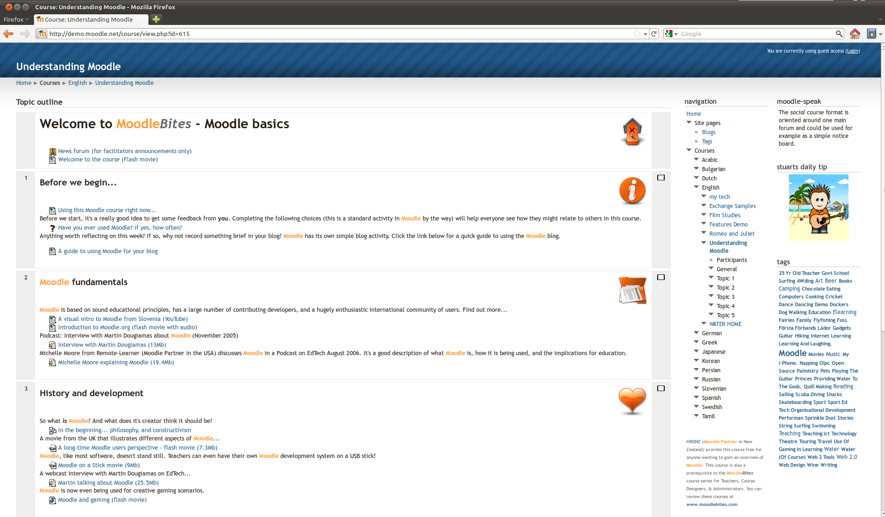

<!--
Nota bene : ce README est automatiquement généré par <https://github.com/YunoHost/apps/tree/master/tools/readme_generator>
Il NE doit PAS être modifié à la main.
-->

# Moodle pour YunoHost

[](https://ci-apps.yunohost.org/ci/apps/moodle/)


[](https://install-app.yunohost.org/?app=moodle)

*[Lire le README dans d'autres langues.](./ALL_README.md)*

> *Ce package vous permet d’installer Moodle rapidement et simplement sur un serveur YunoHost.*  
> *Si vous n’avez pas YunoHost, consultez [ce guide](https://yunohost.org/install) pour savoir comment l’installer et en profiter.*

## Vue d’ensemble

Moodle est une plateforme d'apprentissage conçue pour fournir aux éducateurs, administrateurs et apprenants un système unique robuste, sécurisé et intégré pour créer des environnements d'apprentissage personnalisés. Moodle est largement utilisé dans le monde entier par les universités, les écoles, les entreprises et toutes sortes d'organisations et d'individus.


**Version incluse :** 4.5.1~ynh1

**Démo :** <https://sandbox.moodledemo.net/>

## Captures d’écran



## Documentations et ressources

- Site officiel de l’app : <https://moodle.org/>
- Documentation officielle de l’admin : <https://docs.moodle.org/400/en/Main_page>
- Dépôt de code officiel de l’app : <https://github.com/moodle/moodle>
- YunoHost Store : <https://apps.yunohost.org/app/moodle>
- Signaler un bug : <https://github.com/YunoHost-Apps/moodle_ynh/issues>

## Informations pour les développeurs

Merci de faire vos pull request sur la [branche `testing`](https://github.com/YunoHost-Apps/moodle_ynh/tree/testing).

Pour essayer la branche `testing`, procédez comme suit :

```bash
sudo yunohost app install https://github.com/YunoHost-Apps/moodle_ynh/tree/testing --debug
ou
sudo yunohost app upgrade moodle -u https://github.com/YunoHost-Apps/moodle_ynh/tree/testing --debug
```

**Plus d’infos sur le packaging d’applications :** <https://yunohost.org/packaging_apps>
