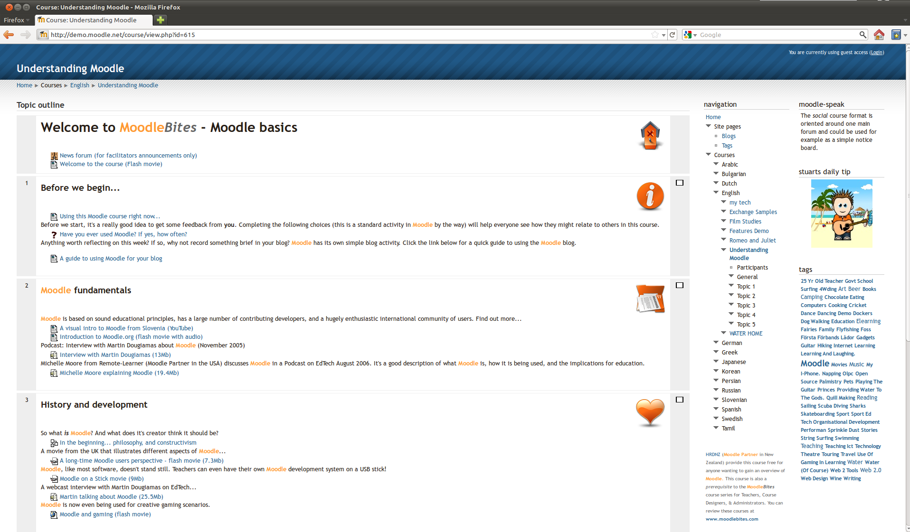

<!--
NB: Deze README is automatisch gegenereerd door <https://github.com/YunoHost/apps/tree/master/tools/readme_generator>
Hij mag NIET handmatig aangepast worden.
-->

# Moodle voor Yunohost

[](https://ci-apps.yunohost.org/ci/apps/moodle/)


[](https://install-app.yunohost.org/?app=moodle)

*[Deze README in een andere taal lezen.](./ALL_README.md)*

> *Met dit pakket kun je Moodle snel en eenvoudig op een YunoHost-server installeren.*  
> *Als je nog geen YunoHost hebt, lees dan [de installatiehandleiding](https://yunohost.org/install), om te zien hoe je 'm installeert.*

## Overzicht

Moodle is a learning platform designed to provide educators, administrators and learners with a single robust, secure and integrated system to create personalised learning environments. Moodle is widely used around the world by universities, schools, companies and all manner of organisations and individuals.


**Geleverde versie:** 4.5.1~ynh1

**Demo:** <https://sandbox.moodledemo.net/>

## Schermafdrukken



## Documentatie en bronnen

- Officiele website van de app: <https://moodle.org/>
- Officiele beheerdersdocumentatie: <https://docs.moodle.org/400/en/Main_page>
- Upstream app codedepot: <https://github.com/moodle/moodle>
- YunoHost-store: <https://apps.yunohost.org/app/moodle>
- Meld een bug: <https://github.com/YunoHost-Apps/moodle_ynh/issues>

## Ontwikkelaarsinformatie

Stuur je pull request alsjeblieft naar de [`testing`-branch](https://github.com/YunoHost-Apps/moodle_ynh/tree/testing).

Om de `testing`-branch uit te proberen, ga als volgt te werk:

```bash
sudo yunohost app install https://github.com/YunoHost-Apps/moodle_ynh/tree/testing --debug
of
sudo yunohost app upgrade moodle -u https://github.com/YunoHost-Apps/moodle_ynh/tree/testing --debug
```

**Verdere informatie over app-packaging:** <https://yunohost.org/packaging_apps>
